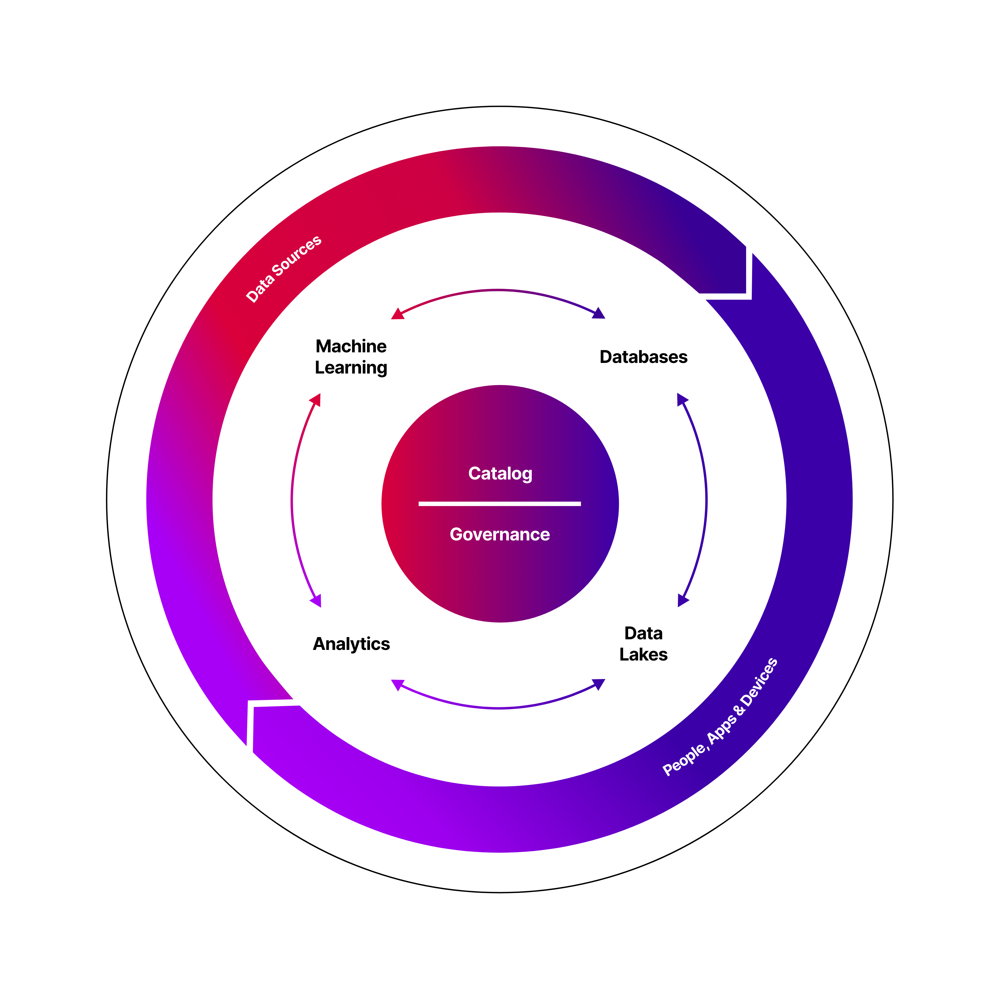
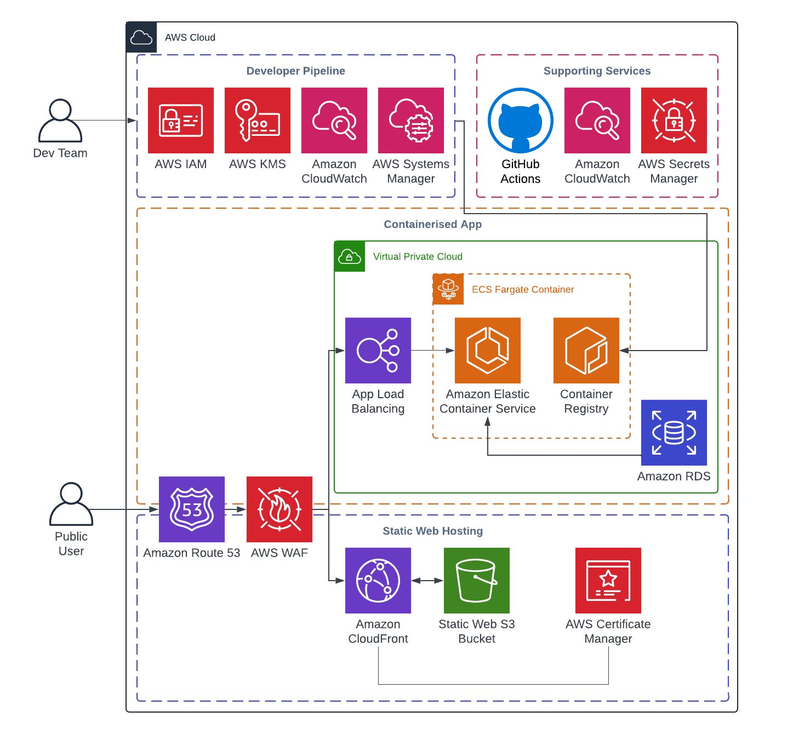

# Firemind Migration Toolkit Framework

[Report issue](https://github.com/hellofiremind/firemind-migration.core/issues/new?assignees=&labels=&template=bug_report.md&title=) . [Submit a feature](https://github.com/hellofiremind/firemind-migration.core/issues/new?assignees=&labels=&template=feature_request.md&title=)

  <!-- TABLE OF CONTENTS -->
  <p>
<details>
  <summary>Table of Contents</summary>
  <ol>
    <li><a href="#initial-setup">Initial Setup</a></li>
    <ol>
      <li><a href="#dependencies">Dependencies</a></li>
      <li><a href="#prerequisites">Pre-requisites</a></li>
      <li><a href="#deploy-iam-role-and-oidc-identity-provider">Deploy IAM Role and OIDC Identity Provider</a></li>
      <li><a href="#github-workflows">GitHub workflows</a></li>
      <li><a href="#infastructure-setup">Infrastructure Setup</a></li>
   </ol>
    <li><a href="#backend-and-frontend-deployments">Backend and Frontend Deployments</a></li>
    <li><a href="#note">Note</a></li>
  </ol>
</details>

**TL;DR**: This framework allows you to get started with a <b>Migration landing zone</b> on AWS using native services.

#### Migration Toolkit is part of [Firemind's Modern Data Strategy](https://www.firemind.com/modern-data-strategy/) tools

[](https://www.firemind.com/modern-data-strategy/)

### Key AWS Services

- AWS ECS Fargate Container
- AWS Identity and Access Management (IAM) Roles
- Amazon Simple Storage Service (Amazon S3) Buckets
- Amazon Virtual Private Cloud (VPC)
- AWS Web Application Firewall (WAF)
- AWS Systems Manager Parameter Store (SSM) Parameters
- AWS Key Management Service (AWS KMS)
- Amazon CloudFront
- Amazon CloudWatch
- Amazon Route 53
- Amazon Relational Database Service (RDS) and Aurora

<!-- ABOUT THE PROJECT -->

## Infrastructure Diagram

[](https://www.firemind.io/offerings/ignite/firemind-migration.core/)

## Initial Setup

<!-- DEPENDENCIES -->

### Dependencies

Please complete these steps before continuing.

1. Install NodeJs with npm (Install instructions in the official repo <a href="https://github.com/nvm-sh/nvm" target="_blank">here</a>
1. Make sure Docker is running on your machine

<!-- PREREQUISITES -->

### Prerequisites

Ensure your CLI has correct credentials to access the AWS account you want this framework deployed to.

To use this framework, create an empty remote repo in your organisation in GitHub, clone a copy of this repo and push to your remote.

Navigate to `github-oidc-federation-template-infra.yml` file and add a Default value for:

- `GitHubOrg`: This should be the name of the organisation where your repo exists.
- `FullRepoName`: The name of the repo which has a copy of this infrastructure.

Add the following to your remote repository secrets:

- `AWS_REGION`: <e.g. eu-west-1>
- `S3_TERRAFORM_STATE_REGION`: <e.g. eu-west-1>
- `S3_TERRAFORM_STATE_BUCKET`: migration-core-<account_id>-state
- `ACTION_IAM_ROLE`: arn:aws:iam::<account_id>:role/GithubActionsDeployMigration

Ensure you have a Route53 Hosted Zone setup in your AWS account - the domain base and DNS Zone values for this R53 Hosted Zone should be specified in the terraform-command.yml file under the TF_VAR_DOMAIN_BASE and TF_VAR_DNS_ZONE variables.

GitHub Actions deployment branches are specified in main.yml under 'push' and 'pull_request'. Ensure you add the names of your key branches here (e.g. ['development', 'staging']). GitHub Action Workflows will not run unless a commit is made to one of the branch names you have specified.

### Deploy IAM Role and OIDC Identity Provider

The first step is to deploy a GitHub Actions Role and GitHub OIDC identity provider in the account that allows you to run GitHub actions for the infrastructure.

**Note:** This only needs to be run once per AWS account.
Details on this can be found here: https://github.com/marketplace/actions/configure-aws-credentials-action-for-github-actions

- <b>Important Note:</b> If an identity provider already exists for your project, then remove the GithubOidc section in the `github-oidc-federation-template-infra.yml` file. <i>Always check that the identity provider exists for your project, which can be found within the AWS IAM console.</i>

Run the following command in the terminal. Ensuring the stack name is unique for the region:

```
aws cloudformation deploy --template-file github-oidc-federation-template-infra.yml --stack-name app-authorisation-infra-github-authentication --region {{ eu-west-1 }} --capabilities CAPABILITY_IAM --capabilities CAPABILITY_NAMED_IAM
```

<!-- GITHUB WORKFLOWS -->

### Github Workflows

GitHub actions is used to deploy the infrastructure.
The config of this can be found in the `.github/workflows`

We send through a variety of different environment variables

- `BUILD_STAGE` - We get this from the branch names
- `S3_TERRAFORM_STATE_BUCKET` - Get this from GitHub secrets
- `S3_TERRAFORM_STATE_REGION` - Get this from GitHub secrets
- `AWS_REGION` - Get this from GitHub secrets
- `SERVICE` - Has default (migration) but can be set by user in the `.github/workflows` files. Namely ecr-deploy.yml, frontend-deploy.yml and terraform-command.yml.
- `DOMAIN_BASE` - Route53 Domain Base value
- `DNS_ZONE` - Route53 DNS Zone value

<!-- INFASTRUCTURE SETUP -->

### Infastructure Setup

For quick setup follow these instructions:

- Create an empty repo within your GitHub account.
- Checkout this repository on staging branch to you local drive and push to your remote repo.
- Assuming the GitHub actions have been set up correctly, the deployment will begin.

If you are having any issues please report a bug via the repo.

<!-- SAMPLE WORKFLOW EXECTUTION DETAILS -->

## Backend and Frontend Deployments

Migration ToolKit uses Terraform Modules and GitHub Actions Matrix's to enable automatic deployment for multiple frontend and backend apps in parallel. The source code for the apps are located in the './frontend' and './backend' folders respectively.

<ul>
  <li>This repo is set up with:
    <ul>
      <li>React for 2x frontend apps</li>
      <li>Wordpress for 1x backend app</li>
      <li>Httpd for 1x backend app</li>
    </ul>
  </li>

  <li><b>Important Note:</b> The property for the app names specified in backend.tf (ecs_service) and frontend.tf (frontend_name) must be identical to the folder name (i.e. './frontend/frontend1') for the app source code. For example, see how ecs_service (line 3) in backend.tf is 'app1' to match the './backend/app1' source code folder. This ensures that the GitHub Actions frontend and backend jobs deploy under the correct naming convention.</li>

  <li>To set up for frontend React, update the src and public folders for your project - these are located in the frontend/appname folders. Then create a frontend deployment in the frontend.tf Terraform file. The deployment process involves running <code>npm run build</code> and uploading the <i>build</i> file into the S3 site bucket. You can view this app by locating the CloudFront site and following the specified DNS.</li>
  
  <li>To setup a backend app, navigate to <code>backend/appname</code> and update this file with your docker image and source code. Then create a backend deployment in the backend.tf Terraform file - ensuring the health check routes, ports and other configuration options are setup correctly. Upon deployment, enter the Route53 Alias name into your web browser. This DNS name is identifiable in 'modules/backend/route53' under the ecs_alias resource.</li>

</ul>

## Note

<li>If you deploy this infrastructure and then destroy it, you must change the name for all secrets - as it is likely that the previous secret name is scheduled for deletion, and therefore reserved for a short period of time. Currently, every secret can be identified with the 'num' keyword forming part of the name. </li>

<!-- MARKDOWN LINKS & IMAGES -->

[issues-url]: https://github.com/hellofiremind/migration-toolkit/issues
[site-url]: https://www.firemind.io/offerings/ignite/ml-core/
[product-screenshot]: https://website-assets.cdn.firemind.io/7/wp-content/uploads/2022/11/ml-core.png

<!-- [arch-screenshot]: https://website-assets.cdn.firemind.io/7/wp-content/uploads/2022/11/img.png -->
